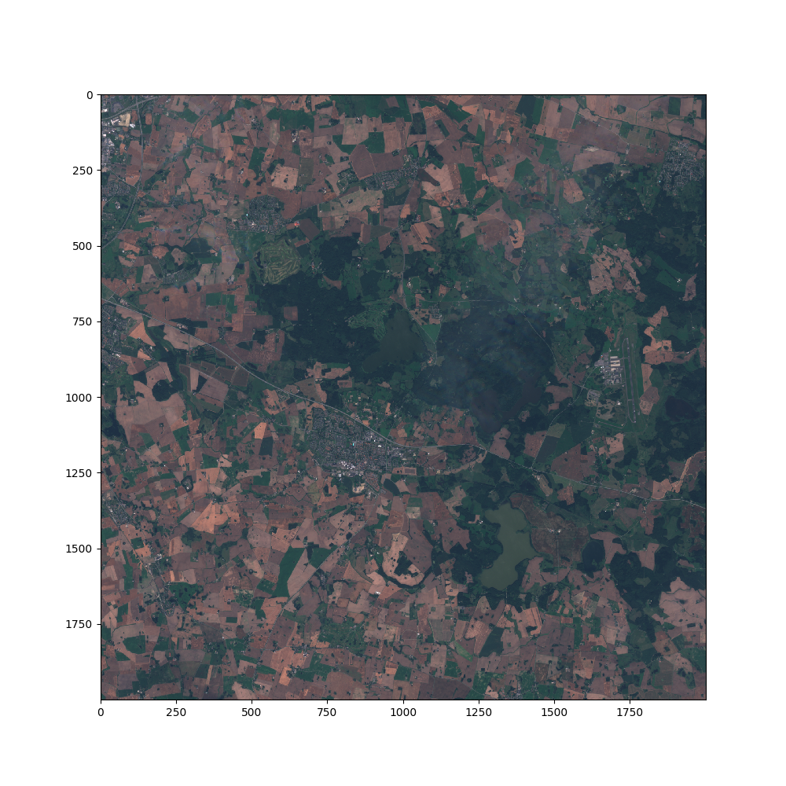

# Hur påverkades Bokskogen av torkan 2018?
I denna uppgift studerar vi [Bokskogen](https://sv.wikipedia.org/wiki/Torups_rekreationsomr%C3%A5de) i centrala Skåne och dess närliggande områdes växtlighet med hjälp av satellitbilder. Bilderna är alla tagna under första halvan av augusti, men från tre olika år. Kan vi se någon skillnad efter en sommar med torka? Vi kommer också använda teori om NDVI (Normalized Difference Vegetation Index) som är ett mått på hur mycket levande växtlighet det finns. För att läsa mer om NDVI och hur man beräknar det, se [denna länk](https://en.wikipedia.org/wiki/Normalized_difference_vegetation_index#Rationale).

För att kunna jämföra bilderna ni senare kommer generera med något mer verklighetsförankrat visar vi här en färgbild på området vi kommer undersöka senare:



Klicka på följande [repl.it](https://repl.it/@OscarWiklund96/Bokskogen) för att få tillgång till datan som används i denna uppgift!


## 1. Växtligheten 2015

Vi börjar med att kolla på sensommaren 2015. I mappen Bokskogen ligger det tre filer som alla heter `data_1X.npz`. Detta är numpy-arrays som innehåller ett heltal för varje pixel, som tillsammans kan skapa en bild. Vi ska börja med att kolla på `data_15.npz`. Skriv följande kod för att ladda in alla nödvändiga paket och npz-filen:

```python
import numpy as np
import matplotlib.pyplot as plt

bands15 = np.load('bokskogen/data_15.npz')
```
Vår `bands15` variabel fungerar nu ungefär som en `dict` och innehåller data för både det röda och det nära infraröda bandet. För att plocka ut något från `bands15` måste vi använda nycklar som vi gjort i tidigare uppgifter med `dict`.

**Uppdrag:** Kan du själv ta reda på vad nycklarna till `bands15` är? 

<details>
<summary markdown="span">
Tips
</summary>
<p>Du kan använda funktionerna <code>print(list())</code> tillsammans med metoden <code>keys()</code>
</p>
</details>

<details>
<summary markdown="span">
Svar
</summary>
<p><code>print(list(bands15.keys()))</code> ger nycklarna <code>"red"</code> och <code>"nir"</code> (nir = near-infrared)</p>
</details>

För att lättare kunna använda datan vill vi nu skapa var sin variabel för de båda banden.

**Uppdrag:** Skapa variablerna `red15` och `nir15` med hjälp av `bands15`. 


<details>
<summary markdown="span">
Svar
</summary>
<p><pre>red15 = bands15['red']
nir15 = bands15['nir']</pre>
</p>
</details>

Vi har nu delat upp datan för de båda banden var för sig. För att få en känsla av vad det faktiskt är för data vi har att göra med skulle vi kunna testa plotta dem.

**Uppdrag:** Plotta en eller båda variablerna vi precis skapade. Vad visar plotten? 

<details>
<summary markdown="span">
Tips
</summary>
<p><pre>plt.imshow(red15)
plt.savefig('red15.png')</pre>
</p>
</details>

<details>
<summary markdown="span">
Svar
</summary>
<p>Plotten visar en bild över Bokskogen med närliggande åkrar och sjöar. Bilderna består endast av ljus från röda respektive nära infraröda bandet, vilket gör att det blir svårt att se vad de föreställer.
</p>
</details>

För att uträkningar ska bli mer exakta vill vi egentligen ha våra värden i form av flyttal. Gör om `red15` och `nir15` till flyttal med hjälp av följande kod:

```python
red15 = red15.astype(float)
nir15 = nir15.astype(float)
```

För att lättare kunna tolka bilden vill vi räkna ut NDVI. Detta kommer göra att partier med mycket växtligher skiljer sig i färg gentemot partier utan växtlighet när vi plottar bilden.

**Uppdrag:** Skapa en variabel `ndvi15` och räkna ut den med hjälp av `red15` och `nir15`.

<details>
<summary markdown="span">
Tips
</summary>
<p>
NDVI kan bestämmas genom ekvationen <code>ndvi = (nir-red)/(nir+red)</code>
</p>
</details>

<details>
<summary markdown="span">
Svar
</summary>
<p>
<code>ndvi15 = (nir15-red15)/(nir15+red15)</code>
</p>
</details>

Vi skulle nu kunna plotta bilden som innan, men för att göra det tydligare använder vi några speciella inställningar. Skriv koden nedan: 

```python
plt.figure(figsize=(10,10))
plt.pcolormesh(ndvi15, cmap='PiYG')
plt.ylim(ndvi15.shape[0], 0)
plt.clim(-1.0, 1.0)
plt.colorbar(label='NDVI')
plt.savefig('colormap.png')
```
**Uppdrag:** Förstår du ungefär vad de olika metoderna gör? Testa ta bort någon del och se vad som händer!

<details>
<summary markdown="span">
Svar
</summary>
<p><ul>
<li><code>plt.figure(figsize=(10,10))</code> skapar en ny figur som har storleken 10\*10 inches (tum).</li>
<li><code>plt.pcolormesh(ndvi15, cmap='PiYG')</code> skapar en färgplot av arrayen som matas in, i detta fallet <code>ndvi15</code>. En färgplot innebär att programmet tar arrayen och läser in den som en bild, och varje värde anger färgen på en pixel. Hur färgerna fördelas kan man ange med <code>cmap</code>-parametern.
</li>
<li><code>plt.ylim(ndvi.shape[0], 0)</code> sätter gränserna för y-axeln. Om vi inte skulle använt detta skulle bilden hamnat upp och ner (testa att ta bort denna och se vad som händer). Detta är för att x-axeln och y-axeln för <code>pcolormesh()</code> börjar nere i vänstra hörnet och ökar till höger respektivt uppåt. Men arrayer börjar uppe i vänstra hörnet och ökar till höger respektive nedåt. <code>ndvi.shape[0]</code> ger oss antalet rader i <code>ndvi</code> så vad vi egentligen gör med <code>plt.ylim(ndvi.shape[0], 0)</code> är att säga till programmet att börja plotta rad <code>ndvi.shape[0]</code> till <code>0</code>, vilket gör bilden rättvänd.</li>
<li><code>plt.clim(-1.0, 1.0)</code> sätter gränserna för färgskalan. Anledningen till att vi sätter -1 till 1 är att NDVI-värden alltid är mellan -1 och 1. Skulle vi inte gjort detta är det de största repektive minsta värdena i <code>ndvi15</code> som sätter gränserna för färgskalan. Detta ger en omotiverad kontrast. </li>
<li><code>plt.colorbar(label='NDVI')</code> gör att vi får ett fält på sidan grafen som illustrerar färgskalan. Vi anger också att det ska stå NDVI bredvid fältet.</li>
<li>Slutligen använder vi <code>plt.savefig('colormap.png')</code> som helt enkelt sparar grafen till filen <code>colormap.png</code>.</li>
</ul>
</p>
</details>

**Uppdrag:** Vad visar bilden? Kan du se vilka bönder som inte har skördat sina åkrar än?

<details>
<summary markdown="span">
Svar
</summary>
<p>
En grön åker tyder på att det finns växtlighet där, medan en vitare åker tyder på att det finns låg växtlighet och att åkern troligtvis är skördad. 
</p>
</details>


## 2. Jämför växtlighet
För att kunna jämföra åren måste vi nu egentligen göra samma sak för 2017 och 2018. Vi skulle kunna skriva ungefär samma kod som vi precis skrivit ytterligare två gånger, men detta är inte särskilt effektivt eftersom vi i princip skriver samma sak tre gånger med ett fåtal utbytta ord. För ändamål som dessa är därför funktioner väldigt användbara. 

**Uppdrag:** Skriv en funktion `plot_ndvi(file_name, save_name)` som tar in en sträng `file_name`, som är namnet på `.npz`-filen du vill läsa in datan från, och sträng `save_name`, som blir namnet på den bild som plottas. Bilden som plottas ska vara baserad på NDVI med liknande inställningar som innan. 

<details>
<summary markdown="span">
Tips
</summary>
<p>
Du kan återanvända väldigt stor del av den kod du redan skrivit. 
</p>
</details>

<details><summary markdown="span">Lösning</summary>
<p>
<pre><code>def plot_ndvi(file_name, save_name):
  bands = np.load(file_name)
  red = bands['red'].astype(float)
  nir = bands['nir'].astype(float)
  ndvi = (nir-red) / (nir+red)
  plt.figure(figsize=(10,10))
  plt.pcolormesh(ndvi, cmap='PiYG')
  plt.ylim(ndvi.shape[0], 0)
  plt.clim(-1.0, 1.0)
  plt.colorbar(label='NDVI')
  plt.savefig(save_name)</code></pre>
</details>


Nu när du har en smidig funktion för att plotta NDVI kan du enkelt göra detta för alla tre år.

**Uppdrag:** Plotta NDVI för 2015, 2017 och 2018. Jämför bilderna. Kan du se någon skillnad? Om du ser skillnad, vilken och varför?

<details><summary markdown="span">Lösning</summary>
<p>
<pre><code>plot_ndvi("bokskogen/data_15.npz", "bok15.png")
plot_ndvi("bokskogen/data_17.npz", "bok17.png")
plot_ndvi("bokskogen/data_18.npz", "bok18.png")
</code></pre>
</details>

<details><summary markdown="span">Svar</summary>
<p>
Torkan 2018 hade sin påverkan på växtligheten. Om du kollar på åkrarna ser du att växtligheten inte är i närheten av de tidigare åren. Det ser ut som att många bönder blev tvugna att skörda de grödor som klarade sig mycket tidigare på grund av torkan. Man kan även se på själva skogen att växtligheten har sjunkit då den inte framstår som lika grön.
</details>


