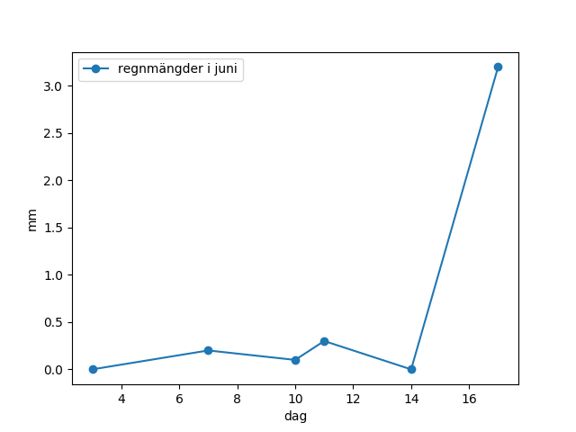

# Väderdata från SMHI. Del A.
SMHI har temperaturer och annan data från olika mätstationer i Sverige.

I detta uppdrag ska vi lära oss om listor och plottning i Python och använda detta för att undersöka temperaturdata från SMHI.

Denna uppgift är tänkt att köras i Python 3 på *repl.it*. Följ denna länk: [https://repl.it/languages/python3](https://repl.it/languages/python3).

## 1. Listor
Vi börjar med några uppdrag för att se hur listor fungerar i Python.
### 1.1 Skapa en lista och skriv ut den
En lista är en sekvens av värden. I koden nedan skapas en lista som sedan skrivs ut.

**Uppdrag 1.1 a:** Kopiera koden nedan och provkör den på *repl.it*.

```python
temps = [14.1, 13.5, 17.5, 16.2, 18.9, 11.3]
print("Temperaturerna är:")
print(temps)
```
Några saker att observera:
*   Man har hakparenteser runt listan
*   Man har kommatecken mellan värdena i listan
*   Decimaltal skrivs med punkt (inte med komma)
*   Listan har sparats i variabeln `temps`
*   En `print`-sats gör att något skrivs ut

Värdena ovan är temperaturer som mätts upp under ett antal dagar i juni. Tabellen nedan visar temperaturerna, regnmängderna och vilka dagar det gäller.

|dag|3|7|10|11|14|17|
|:--:|--:|-:|--:|-:|-:|-:|
|**temp**|14.1|13.5|17.5|16.2|18.9|11.3|
|**regn**|0|0.2|0.1|0.3|0|3.2|

När vi programmerar i denna uppgift så kommer vi att skapa ytterligare två listor: `days` och `rain`, för att hålla reda på värdena i tabellen.

(Vi använder ofta engelska namn i programmen eftersom namn i program normalt inte får innehålla svenska tecken som `å`, `ä` och `ö`.)

**Uppdrag 1.1 b:** Lägg till kod som skapar en lista `days` med värdena för dagarna i tabellen (3, 7, 10, ...) och som sedan skriver ut listan, på liknande sätt som i förra exemplet. Provkör koden för att se att den fungerar.

Om du inte vet hur du skall göra så finns lösningen här.
<details>
<summary markdown="span">
Lösning
</summary>
<p><pre><code>days = [3, 7, 10, 11, 14, 17]
print("Dagarna är:")
print(days)
</code></pre></p>
</details>

\
**Uppdrag 1.1 c:** Lägg till kod som på liknande sätt skapar en lista `rain` med värdena för regnmängderna i tabellen. Anropa också `print` som tidigare så att du kan se att den nya listan har rätt värden.

<details>
<summary markdown="span">
Lösning
</summary>
<p>
<pre><code>rain = [0, 0.2, 0.1, 0.3, 0, 3.2]
print("Regnmängderna är:")
print(rain)
</code></pre>
</p>
</details>

\
I fortsättningen kommer vi att använda variablerna `days`, `temps` och `rain`, så behåll koden som räknar ut dem. Print-satserna har vi bara haft för att kontrollera att rätt sak räknas ut, så de behövs inte längre. Du kan antingen ta bort dem, eller *kommentera* bort dem: I Python används brädgård (`#`) för att ange att resten av raden är en kommentar. Till exempel:

```python
print(temps) # Denna print-sats kommer att köras
# print(rain) Men denna är en kommentar och körs inte
```

**Uppdrag 1.1 d:** Kommentera bort några av print-satserna i din kod. (Kanske vill du dock ha kvar någon av print-satserna för att se att någonting händer när du kör programmet.)


### 1.2 Beräkna medeltemperatur med `sum` och `len`
Det finns en inbyggd funktion `sum(list)` som kan summera elementen i en lista. Det finns också en inbyggd funktion `len(list)` som ger längden på listan. ("len" står för "length".)

**Uppdrag 1.2 a:** Följande kod räknar ut summan av temperaturerna och längden på listan och skriver ut värdena. Kopiera och provkör koden. Vad blir resultatet?
```python
s = sum(temps)    # beräkna summa
print(s)          # skriv ut
n = len(temps)    # beräkna antalet
print(n)          # skriv ut
```

Som du ser blir summan inte exakt 91.5, utan visas med många decimaler. Hur kan det vara så? Jo, det beror på att tal representeras binärt i datorn, dvs med nollor och ettor. Många decimaltal kan inte representeras exakt med binära tal, så omvandlingen ger avrundningsfel.

**Uppdrag 1.2 b:** För att få en finare utskrift kan vi använda funktionen `round(v, d)` som avrundar ett värde `v` till `d` decimaler. Prova följande exempel:


```python
third = 1/3                 # beräkna värdet
rounded = round(third, 2)   # avrunda
print(rounded)              # skriv ut
```

Koden ovan kommer först att räkna ut 1/3, sedan avrunda till 2 decimaler (med `round`) och sedan skriva ut resultatet (med `print`).

**Uppdrag 1.2 c:** Om vi vill kan vi skriva allt som en enda sats i stället. Prova att ändra koden till följande sats. Vi har ersatt varje variabel med dess definition:

```python
print(round(1/3, 2))
```

Vi kan observera att när en funktion anropas, så beräknas först argumenten till funktionen. Därför kommer först 1/3 att beräknas, sedan `round` att anropas, och sist kommer `print` att anropas (med resultatet från `round`).

**Uppdrag 1.2 d:** Skriv liknande kod (med en eller flera rader, vilket du vill) så att summan av temperaturerna skrivs ut avrundat till en decimal.

<details>
<summary markdown="span">
Lösning:
</summary>
<p>Som en kodrad:
<pre><code>print(round(sum(temps),1))</code>
</pre>
</p>
<p>
Eller som flera rader:
<pre><code>s = sum(temps)
rounded = round(s, 1)
print(rounded)</code></pre>
</p>
</details>

\
**Uppdrag 1.2 e:** Nu när vi vet hur man räknar ut summan och längden av en lista så kan vi lätt räkna ut medeltemperaturen för värdena i `temps`. Skriv kod som räknar ut medeltemperaturen och skriver ut resultatet, avrundat till en decimal.

*Tips!*  Du kan skriva koden så att du gör varje sak i tur och ordning och sparar varje delresultat i en variabel:

* räkna ut summan av temperaturerna, spara i `s`
* räkna ut antalet temperaturer (längden på listan), spara i `n`
* räkna ut medelvärdet genom att dividera dessa, spara i `average_temp`
* avrunda medelvärdet till en decimal, spara i `rounded`
* skriv ut resultatet

Om du vill kan du sedan försöka skriva koden som en enda rad (byt ut varje användning av en variabel mot motsvarande beräkning).

<details>
<summary markdown="span">
Lösning
</summary>
<p>Som flera kodrader:
<pre><code>s = sum(temps)
n = len(temps)
average_temp = s/n
rounded = round(average_temp, 1)
print(rounded)</code>
</pre>
</p>
<p>
Eller som en enda rad:
<pre><code>print(round(sum(temps)/len(temps),1))</code></pre>
</p>
</details>

\
Observera att om man skriver allt på samma rad kan det ibland bli svårläst, även om koden blir kortare. Det kan vara bra att dela upp en stor beräkning i delar och sätta namn på de viktiga delarna. Då blir koden mer lättläst.

**Uppdrag 1.2 f:** Ändra din kod så att du använder två rader: en där du räknar ut medelvärdet av temperaturerna, och en där du avrundar och skriver ut. Något i följande stil:

```python
average_temp = ...
print(round(..., ...))
```

Observera att man i Python ofta använder underscore (`_`) inuti långa variabelnamn, som `average_temp`, eftersom variabler inte får innehålla blanktecken. Det blir mer läsbart än om man skriver `averagetemp`.  

<details>
<summary markdown="span">
Lösning
</summary>
<p>
<pre><code>average_temp = sum(temps)/len(temps)
print(round(average_temp, 1))</code>
</pre>
</p>
</details>

\
**Uppdrag 1.2 g:** Lägg till liknande kod för att räkna ut medelvärdet av regnmängderna.

<details>
<summary markdown="span">
Lösning
</summary>
<p>
<pre><code>average_rain = sum(rain)/len(rain)
print(round(average_rain, 1))</code>
</pre>
</p>
</details>


\
**Uppdrag 1.2 h:** Snygga till ditt program så att du bara har kvar koden för att räkna ut `days`, `temps`, `rain`, `average_temp` och `average_rain`. Övrig kod kan tas bort eller kommenteras bort.

### 1.3 Accessa list-element

Du kan accessa (komma åt) enskilda element i en lista `lst` med notationen `lst[i]` där `i`  är indexet (positionen) för elementet i listan. Första elementet har index 0, nästa index 1, osv.

(I programmering numreras element från 0 i stället för 1 för att det ofta ger enklare kod. Indexet är egentligen avståndet från det första elementet.)

Här är ett exempel på en lista där elementen är strängar.
```python
song = ["glad", "såsom", "fågeln", "i", "morgonstunden"]
print(song[0], song[3], song[4])
```

**Uppdrag 1.3 a:** Kopiera och provkör koden ovan. Vilka element skrivs ut?

Observera att man kan skriva ut flera saker på samma rad genom att ha flera argument i samma print-sats.

**Uppdrag 1.3 b:** Vad händer om man försöker accessa "utanför" listan, med ett index som är för stort? Prova att göra t.ex. `print(song[17])`. Du får ett felmeddelande med "Traceback" (talar om var felet uppstod) och "IndexError" (talar om vilken slags fel det var). Kan du förstå felmeddelandet?

**Uppdrag 1.3 c:** Skriv kod som skriver ut första, andra och tredje elementet i listan `rain`.

<details>
<summary markdown="span">
Lösning
</summary>
<p><pre><code>print(rain[0], rain[1], rain[2])
</code></pre></p>
</details>

\
**Uppdrag 1.3 d:** Skriv kod som räknar ut medelvärdet av de tre första elementen i `rain`.

*Tips!* Gör detta genom att lägga ihop de tre värdena och dividera med tre. Kalla detta värde t.ex. `avg3`. Därefter avrundar du och skriver ut resultatet.

Blir värdet större eller mindre än medelvärdet för hela listan som du räknade ut tidigare?

<details>
<summary markdown="span">
Lösning
</summary>
<p><pre><code>avg3 = (rain[0] + rain[1] + rain[2])/3
print(round(avg3, 1))
</code></pre></p>
</details>

### 1.4 Loopa över listor

**Uppdrag 1.4 a:** En `for` sats kan loopa över elementen i en lista. Provkör följande kod som skriver ut alla orden i listan `song`:

```python
for word in song:
  print(word)
```


Saker att observera:
* For-loopen körs lika många varv som det finns element i listan.
* Variabeln `word` kallas *loopvariabel*. För varje varv får `word` nästa värde i listan.
* Satsen `print(word)` skriver ut värdet.

**Uppdrag 1.4 b:** Du kan använda ett annat namn på loopvariabeln om du vill. Prova att ändra namnet från `word` till `w` och kör koden för att kontrollera att den gör samma sak som tidigare.

**Uppdrag 1.4 c:** Skriv kod som skriver en liknande loop, och som skriver ut alla regnmängderna i listan `rain`. Här kan det passa att kalla loopvariabeln t.ex. `r`.
<details>
<summary markdown="span">
Lösning
</summary>
<p><pre><code>for r in rain:
  print(r)
</code></pre></p>
</details>

\
**Uppdrag 1.4 d:** För att loopa ett visst antal gånger används ofta  en `for` loop med en `range`. Provkör följande exempel.
```python
for i in range(4):
  print("värdet är", i)
```


Observera att:
*  Loopen gör 4 varv.
*  Loopvariabeln `i` får värdena 0, 1, 2, 3 i tur och ordning

**Uppdrag 1.4 e:** Vi ska nu loopa på ett liknande sätt över `rain`. För att veta hur många varv vi skall loopa använder vi `len`. Provkör följande kod:

```python
for i in range(len(rain)):
  print(rain[i])
```

Det här verkar ju bara vara ett krångligare sätt att göra samma sak som vi gjorde i uppdraget 1.4 c. Men vi ska strax se att vi har mer nytta av loopvariabeln `i`.


**Uppdrag 1.4 f:** Ändra koden så att även dagen och temperaturen skrivs ut i loopen. Till exempel ska de två första raderna bli:

    3 14.1 0
    7 13.5 0.2

<details>
<summary markdown="span">
Lösning
</summary>
<p><pre><code>for i in range(len(rain)):
  print(days[i], temps[i], rain[i])
</code></pre></p>
</details>

\
**Uppdrag 1.4 g:** Ändra koden så att du lägger till begriplig text, t.ex. så att de första två raderna blir

    Den 3 juni var temperaturen 14.1 grader och det regnade 0 mm.
    Den 7 juni var temperaturen 13.5 grader och det regnade 0.2 mm.

<details>
<summary markdown="span">
Lösning
</summary>
<p><pre><code>for i in range(len(rain)):
  print("Den", days[i], "juni var temperaturen", temps[i], "grader och det regnade", rain[i], "mm.")
</code></pre></p>
</details>

\
**Uppdrag 1.4 h:** I följande uppgifter behöver du ha kvar koden som räknar ut `days`, `temps` och `rain`. Övrig kod kan tas bort eller kommenteras bort.

## 2. Plottning
Nu skall vi titta på hur plottning fungerar i Python.

### 2.1 Plotta en kurva

Vi börjar med att plotta en temperaturkurva med dagar på x-axeln och temperaturer på y-axeln.

**Uppdrag 2.1:** Vi använder biblioteket `matplotlib` för att plotta. Provkör följande kod:
```python
import matplotlib.pyplot as plt

plt.plot(days, temps)
plt.savefig("temperaturkurva.png")
```
Några saker att observera:
*   `import`-satsen ger oss access till biblioteket `matplotlib.pyplot` och låter oss använda det lite kortare namnet `plt` för det.
*   anropet till `plt.plot`-funktionen anger att vi vill ha  `days` på x-axeln och `temps` på y-axeln.
*  `plt.savefig()`  sparar plotten som en bild som du kan hitta under *Files* på vänster sida av repl.it-fönstret. Repl.it visar även bilden automatiskt när den sparas. I andra miljöer kan man behöva att använda `plt.show()` för att bilden ska synas.

### 2.2 Experimentera med fel vid plottning
En viktig sak när man plottar är att listorna för x och y-värdena måste vara lika långa. Annars får man ett felmeddelande.

Till exempel är följande anrop felaktigt

    plt.plot([3, 7, 10], temps)

eftersom listan av x-värden är kortare än temperaturlistan `temps`.

**Uppdrag 2.2:**
*  Provkör det felaktiga anropet ovan för att se att du får ett felmeddelande.
*  Felmeddelandet innehåller mycket information, men längst ner hittar du en förklaring av felet (`ValueError: ...`). Kan du förstå förklaringen?
*  Kan du ändra koden så att du blir av med felmeddelandet? (*Tips!* Ändra listan med x-värden så att den har lika många element som `temps`.)

<details>
<summary markdown="span">
Lösning
</summary>
<p>
I felmeddelandet kan man se att första listan har längden 3, medan den andra har längden 6. För att bli av med felmeddelandet kan man ändra första listan så att den också får 6 element. Till exempel:
<pre><code>plt.plot([3, 7, 10, 11, 14, 17], temps)
</pre></code></p>
</details>

### 2.3 Gör en mer informativ plott
Det finns många olika möjligheter att göra plotten finare och mer informativ. Vi borde till exempel skriva ut
*  vad x och y-axlarna visar (dag och grader Celsius)
*  en teckenförklaring som säger vad kurvan visar (temperaturer i juni)

Det vore också bra att sätta en prick för varje mätvärde, eftersom många dagar saknar mätvärde. (T.ex. inleds mätvärden med värden från den 3:e och 7:e juni i exemplet.)

**Uppdrag 2.3 a:** Prova koden nedan för att se hur man får med denna information.

```python
plt.plot(days, temps, "o-", label="temperaturer i juni")
plt.xlabel("dag")
plt.ylabel("grader Celsius")
plt.legend()
plt.savefig("temperaturkurva.png")
```

Förklaring:
* anropet `xlabel` skriver ut etikett (label) på x-axeln
* anropet `ylabel` skriver ut etikett på y-axeln
* anropet `legend` skriver ut en teckenförklaring ("legend" på engelska).
*  parametern `label=...` i plot-anropet sätter en etikett (label) på kurvan. Denna etikett skrivs ut om man anropar `legend`
*  parametern `o-` i plot-anropet ger ett "format" för kurvan, och säger att det skall vara en prick för varje mätvärde och linjer emellan. Det finns många andra "format" att välja på. T.ex. kommer `r+--` att rita en röd kurva med ett plus-tecken för varje mätvärde och streckade linjer emellan.

**Uppdrag 2.3 b:** Kopiera koden för plottningen i föregående uppdrag och experimentera med andra värden för format, label, xlabel och ylabel. Kan du få en grön kurva med streckade linjer?

##### Detaljer om format (hoppa över om du vill)

Om du är intresserad av fler exempel på vilka format som kan användas i plot-anrop kan du titta i den officiella handledningen för pyplot: https://matplotlib.org/tutorials/introductory/pyplot.html. Om du vill se alla möjligheter för format så hittar du det i dokumentationen för plot-funktionen: https://matplotlib.org/3.1.1/api/_as_gen/matplotlib.pyplot.plot.html, se sektionen <i>Notes</i>.

##### Detaljer om valfria och namngivna parametrar (hoppa över om du vill)

Format-parametern är ett exempel på en *valfri* parameter. Den har ett standardvärde som används om man inte anger parametern. Standardvärdet för format-parametern är `b-` (blå linje).

Parametern `label=...` är ett exempel på en *namngiven* parameter. Namngivna parametrar måste komma i slutet på anropet (efter icke-namngivna) och ordningen mellan dem spelar ingen roll. De är praktiska att använda när en funktion har väldigt många valfria parametrar (vilket `plot` har).

### 2.4 Skapa en egen plott

**Uppdrag 2.4:** Nu kan du lite om plottning. Skriv kod för att plotta regnmängderna (använd listan `rain` som vi skapade tidigare). Kan du göra plotten fin och informativ med etiketter på axlarna och en "legend" (så att man ser vilken kurva som är vilken)?

*Tips!*
Arbeta i små steg: gör en sak i taget och provkör koden efter varje steg så du ser att det blir rätt.
  * Anropa `plt.plot(...)` så att dagarna hamnar på x-axeln och regnmängderna på y-axeln.
  * Anropa `plt.savefig("regnkurva.png")` för att din plot ska sparas och visas.
  * Om du har två anrop till `savefig` i ditt program bör du anropa `plt.close()` efter den första `savefig`, så att figuren rensas innan du börjar plotta nästa diagram.
  * Lägg till `o-` som parameter till `plot` för att få prickar för värdena.
  * Lägg till anrop till `plt.xlabel(...)` och `plt.ylabel(...)` för att sätta etiketter på axlarna.
  * Lägg till parametern `label=...` i plot-anropet och anrop till `plt.legend()` för att få ut "legenden" (teckenförklaringen) för kurvan.

Om du gjort rätt så bör ditt diagram se ut något i följande stil



<details>
<summary markdown="span">
Lösning
</summary>
<p>
<pre><code>plt.plot(days, rain, "o-", label="regnmängder i juni")
plt.xlabel("dag")
plt.ylabel("mm")
plt.legend()
plt.savefig("regnkurva.png")
</code></pre>
</p>
</details>

### 2.5 Plotta flera kurvor

Vi kan lägga flera kurvor i samma diagram.

**Uppdrag 2.5:** Genom att göra flera anrop till `plot` kan vi skapa ett diagram med flera kurvor. Ändra din kod så att du visar både regnmängden och temperaturen i samma diagram. Kan du göra ett fint informativt diagram med olika färg på kurvorna? Vad skall du skriva för etikett på y-axeln?

<details>
<summary markdown="span">
Lösning
</summary>
<p>
Här är ett exempel på hur vi kan göra:
<pre><code>plt.plot(days, rain, "bo-", label="regnmängder i juni")
plt.plot(days, temps, "ro-", label="temperaturer i juni")
plt.xlabel("dag")
plt.ylabel("mm eller grader")
plt.legend()
plt.savefig("regnochtemp.png")
</pre></code></p>
</details>

## 3. Quiz

### Fråga 1
Vilka av dessa är en lista i python?
*   `[0, 1, 7]`
*   `(0, 1, 7)`
*   `{0, 1, 7}`

<details>
<summary markdown="span">
Svar
</summary>
<p>
<code>[0, 1, 7]</code>
</p>
</details>

### Fråga 2
Vad skriver man för att få längden på en lista som kallas `data`?
* `len(data)`
* `size(data)`
* `range(data)`

<details>
<summary markdown="span">
Svar
</summary>
<p>
<code>len(data)</code>
</p>
</details>

### Fråga 3

Vad skriver följande kodstycke ut?

```python
list = [1, 3, 5]
print(sum(list))
```

<details>
<summary markdown="span">
Svar
</summary>
<p>
<code>9</code>
</p>
</details>

### Fråga 4

Vad skriver följande kodstycke ut?

```python
list = ["hej", "på", "dig"]
print(list[1])
```

<details>
<summary markdown="span">
Svar
</summary>
<p>
<code>på</code>
</p>
</details>

### Fråga 5
Vilket fel får man när följande kod körs:
```python
data = [1, 3, 5]
print(data[42])
```
* `IndexError: list index out of range`
* `ValueError: x and y must have same first dimension ...`
* `NameError: name 'data' is not defined`

<details>
<summary markdown="span">
Svar
</summary>
<p>
<code>IndexError: list index out of range</code>
</p>
</details>

### Fråga 6

Vad skriver följande kodstycke ut?

```python
list = ["hej", "på", "dig"]
for word in list:
    print(word)
```

<details>
<summary markdown="span">
Svar
</summary>
<p>
<pre><code>hej
på
dig</code>
</pre>
</p>
</details>

### Fråga 7

Vad skriver följande kodstycke ut?

```python
list = ["hej", "på", "dig"]
for i in range(2):
    print(list[i])
```

<details>
<summary markdown="span">
Svar
</summary>
<p>
<pre><code>hej
på</code>
</pre>
</p>
</details>

### Fråga 8
Vad behöver man skriva tidigare i koden för att kunna göra följande anrop: `plt.plot(...)`?
* `import matplotlib`
* `import matplotlib.pyplot`
* `import matplotlib.pyplot as plt`

<details>
<summary markdown="span">
Svar
</summary>
<p>
<code>import matplotlib.pyplot as plt</code>
</p>
</details>

### Fråga 9

Vad kommer det att stå på x-axeln i plotten som genereras av följande kod?

```python
x = [1, 2, 3]
y = [1, 4, 9]
plt.plot(x, y)
plt.xlabel("mina fina x-värden")
plt.ylabel("mina vackra y-värden")
```

<details>
<summary markdown="span">
Svar
</summary>
<p>
<code>mina fina x-värden</code>
</p>
</details>

### Fråga 10
Vad behöver man skriva senare i koden för att diagrammet som skapas med `plt.plot(...)` skall sparas i en fil med namnet `file.png`?
* `plt.savefig("file.png")`
* `plt.save()`
* `plt.savefig(file.png)`

<details>
<summary markdown="span">
Svar
</summary>
<p>
<code>plt.savefig("file.png")</code>
</p>
</details>
