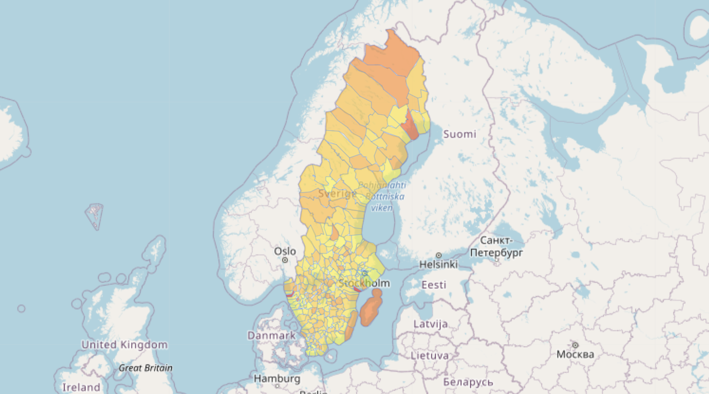

# LU Miljödataprogrammering

Välkommen till programmeringens värld!

Här hittar du uppdrag i Python där vi använder öppen "miljö"-data, t.ex. från satelliter och väderstationer för att med programmering undersöka intressanta frågor relaterade till [FNs globala mål](https://www.globalgoals.org). Målet med uppdragen är att du

* lär dig om programmering och hur man kan göra beräkningar på stora datamängder
* lär dig om olika typer av data, t.ex. mätvärden från satelliter och väderstationer och hur man kan använda dem för att förstå vad som händer i vår miljö
* tränar entreprenöriella förmågor genom ett aktivt lärande och verklighetsförankrade uppgifter med riktiga data

Vi hoppas du tycker att uppdragen är roliga och intressanta, och får en insikt i hur programmering kan användas för att utforska olika frågor.

## Vad behöver du?

Ingen installation av programvara krävs. Vi använder online-miljöerna *replit.com* och *Google Colab* för programmeringen. För Colab krävs att du har ett googlekonto. För *replit.com* behöver du skaffa ett konto.

## Se mer info i flikarna

* [Inspiration](exercises/inspiration.md): 10-20 minuters uppdrag. Inga förkunskaper.
* [Uppdrag](exercises/README.md): 1-2 timmars uppdrag som bygger på varandra.
* [Hjälp](exercises/help.md): Snabbreferenser och andra tips.
* [För lärare](exercises/handledning.md): För lärare i skolan och pedagoger på science centers.
* [Mer](exercises/more.md): Prototypuppdrag som ännu inte är bearbetade pedagogiskt.

---

